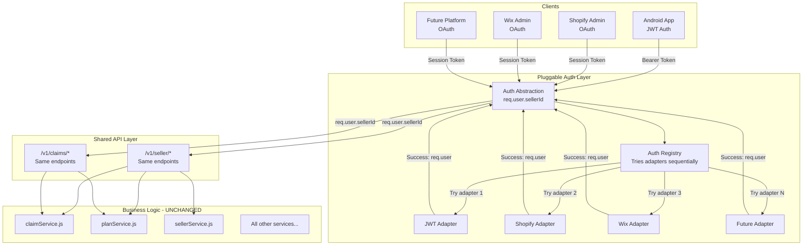
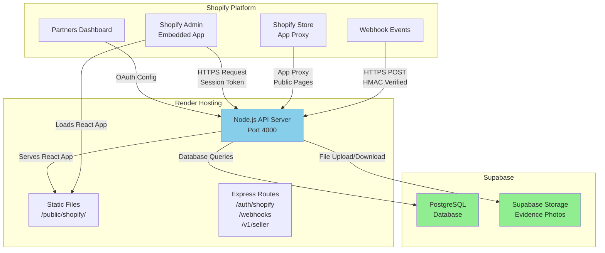
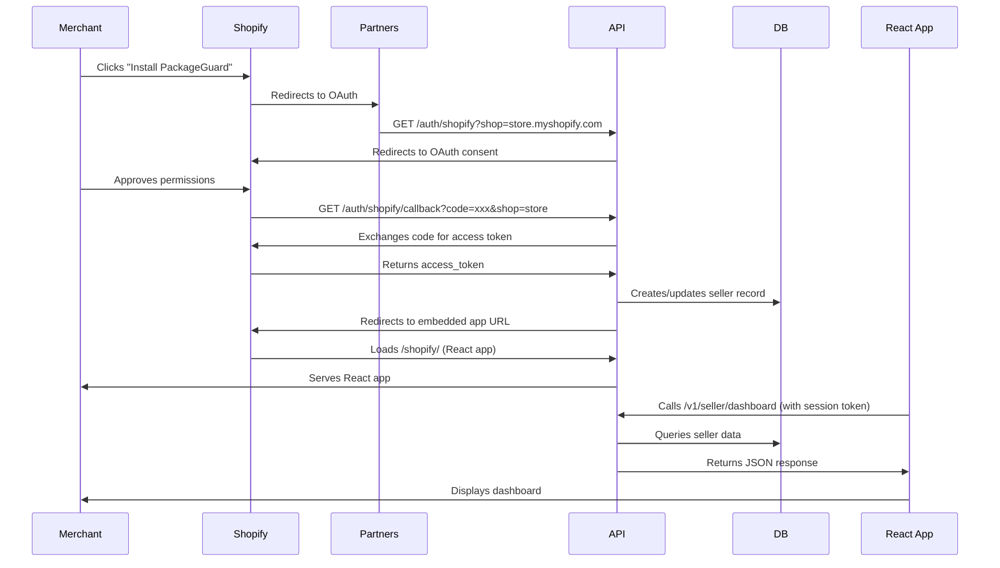
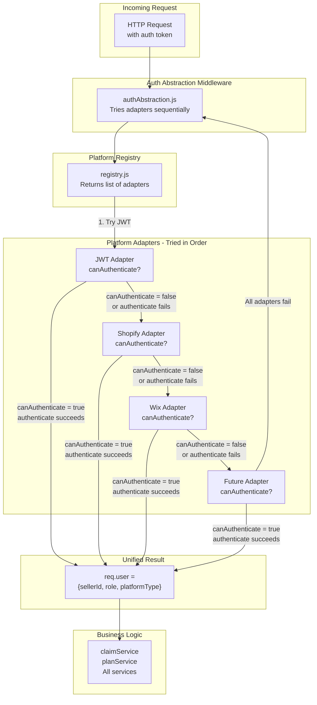

# Convert PackageGuard to Support Both Android & Shopify Apps

## Overview

Transform PackageGuard to support **both** Android app sellers and Shopify embedded app sellers using a **shared backend architecture**. All business logic remains generic and unchanged - only authentication and frontend presentation layers differ. Both Android and Shopify sellers use the same API endpoints and business logic.

## Core Architecture Principle

**Single Source of Truth**: All business logic lives in services and is completely agnostic to authentication method or frontend. Both Android and Shopify sellers resolve to the same `sellerId` format that business logic already uses.



## Key Design Decisions

1. **Pluggable Platform Architecture**: Use adapter pattern - each e-commerce platform (Shopify, Wix, WooCommerce, etc.) is a plugin that implements the same interface
2. **Authentication Abstraction**: All platforms resolve to `req.user.sellerId` - business logic never knows the difference
3. **Unified API**: Same endpoints serve all platforms (`/v1/seller/*`, `/v1/claims/*`)
4. **Generic Business Logic**: All services (`claimService`, `planService`, etc.) remain **completely unchanged**
5. **Frontend Separation**: Only UI layers differ - Android uses native UI, each platform has its own admin UI
6. **Seller Identification**: All auth methods map to the same `seller_id` field in database
7. **Extensible Schema**: Database supports unlimited platforms via flexible schema design

## Implementation Plan

### 1. Database Schema Updates - Extensible for Multiple Platforms

**File**: [`packageguard-api/src/migrations/004_platform_integration.sql`](packageguard-api/src/migrations/004_platform_integration.sql)

**Changes**:

**Sellers Table**:

- Add `platform_type` VARCHAR(50) (not enum - supports unlimited platforms: 'jwt', 'shopify', 'wix', 'woocommerce', etc.)
- Add `platform_identifier` VARCHAR(255) (nullable, indexed) - e.g., shopify shop domain, wix site ID
- Add `platform_access_token` TEXT (encrypted, nullable) - stores encrypted OAuth token
- Add `platform_metadata` JSONB (nullable) - flexible storage for platform-specific data
                                                                                                                                                                                                                                                                - Example: `{"shop_domain": "mystore.myshopify.com", "scope": "read_orders", "installed_at": "2024-01-01"}`
- Add `platform_installed_at` TIMESTAMP (nullable)
- Make `password_hash` nullable (platform sellers don't need passwords)

**Claims Table**:

- Add `platform_order_id` VARCHAR(255) (nullable) - links to platform-specific order ID
- Add `platform_metadata` JSONB (nullable) - platform-specific claim data

**New Table: `platform_configs`** (optional, for platform-specific settings):

```sql
CREATE TABLE platform_configs (
    id UUID PRIMARY KEY DEFAULT gen_random_uuid(),
    seller_id UUID REFERENCES sellers(id) ON DELETE CASCADE,
    platform_type VARCHAR(50) NOT NULL,
    config_key VARCHAR(100) NOT NULL,
    config_value JSONB,
    created_at TIMESTAMP WITH TIME ZONE DEFAULT NOW(),
    UNIQUE(seller_id, platform_type, config_key)
);
```

**Key Point**:

- Existing sellers: `platform_type='jwt'` (default)
- New platform sellers: `platform_type='shopify'`, `platform_type='wix'`, etc.
- Schema supports unlimited platforms without migration
- Platform-specific data stored in JSONB for flexibility

### 2. Pluggable Platform Adapter Architecture

**New Directory**: [`packageguard-api/src/platforms/`](packageguard-api/src/platforms/)

**Structure**:

```
platforms/
├── base/
│   └── PlatformAdapter.js      # Base class/interface
├── jwt/
│   ├── jwtAdapter.js           # JWT platform adapter
│   └── jwtAuth.js              # RENAMED from auth.js
├── shopify/
│   ├── shopifyAdapter.js       # Shopify platform adapter
│   ├── shopifyAuth.js          # Shopify auth middleware
│   ├── shopifyOAuthService.js  # OAuth handler
│   └── shopifyAdminService.js  # Admin API client (optional)
└── wix/                        # Future: Wix adapter
    ├── wixAdapter.js
    ├── wixAuth.js
    └── wixOAuthService.js
```

**New File**: [`packageguard-api/src/platforms/base/PlatformAdapter.js`](packageguard-api/src/platforms/base/PlatformAdapter.js)

Base interface that all platform adapters must implement:

```javascript
class PlatformAdapter {
  // Platform identifier (e.g., 'shopify', 'wix', 'jwt')
  getPlatformType() { }
  
  // Check if this adapter can handle the request
  canAuthenticate(req) { }
  
  // Authenticate and return req.user format
  async authenticate(req) { return { sellerId, sub, role, platformType } }
  
  // Optional: Validate order belongs to platform
  async validateOrder(sellerId, orderId) { }
  
  // Optional: Get order details from platform
  async getOrderDetails(sellerId, orderId) { }
}
```

**New File**: [`packageguard-api/src/middleware/authAbstraction.js`](packageguard-api/src/middleware/authAbstraction.js)

Unified authentication middleware that:

- Registers all platform adapters
- Tries each adapter in order until one succeeds
- All adapters resolve to `req.user = { sellerId, sub, role, platformType }`
- Returns 401 if no adapter can authenticate

**Implementation**:

```javascript
const platformRegistry = require('../platforms/registry');

async function authenticate(req, res, next) {
  // Try each registered platform adapter
  for (const adapter of platformRegistry.getAdapters()) {
    if (adapter.canAuthenticate(req)) {
      try {
        req.user = await adapter.authenticate(req);
        return next();
      } catch (err) {
        // Try next adapter
        continue;
      }
    }
  }
  return res.status(401).json({ error: { message: 'Authentication required' } });
}
```

**New File**: [`packageguard-api/src/platforms/registry.js`](packageguard-api/src/platforms/registry.js)

Platform adapter registry:

```javascript
const adapters = [];

function registerAdapter(adapter) {
  adapters.push(adapter);
}

function getAdapters() {
  return adapters;
}

// Auto-register all adapters
registerAdapter(require('./jwt/jwtAdapter'));
registerAdapter(require('./shopify/shopifyAdapter'));
// Future: registerAdapter(require('./wix/wixAdapter'));

module.exports = { registerAdapter, getAdapters };
```

**Key Point**:

- Adding new platforms = create new adapter in `platforms/{platform}/` and register it
- Zero changes to business logic or controllers
- All adapters produce identical `req.user` format

### 3. Platform-Specific OAuth & Session Management

**Shopify Implementation**:

**New Files**:

- [`packageguard-api/src/platforms/shopify/shopifyAdapter.js`](packageguard-api/src/platforms/shopify/shopifyAdapter.js) - Implements PlatformAdapter
- [`packageguard-api/src/platforms/shopify/shopifyOAuthService.js`](packageguard-api/src/platforms/shopify/shopifyOAuthService.js) - OAuth callback handler
- [`packageguard-api/src/platforms/shopify/shopifySessionService.js`](packageguard-api/src/platforms/shopify/shopifySessionService.js) - Session token storage
- [`packageguard-api/src/routes/shopifyRoutes.js`](packageguard-api/src/routes/shopifyRoutes.js) - OAuth routes (`/auth/shopify/callback`)

**OAuth Flow**:

1. Shopify redirects to `/auth/shopify/callback` with code
2. Exchange code for access token
3. Look up or create seller record:

                                                                                                                                                                                                                                                                                                                                                                                                - If `platform_identifier` (shop domain) exists: update access token
                                                                                                                                                                                                                                                                                                                                                                                                - If new: create seller with `platform_type='shopify'` and generate `seller_id` (same format as JWT sellers)

4. Store encrypted access token in `platform_access_token`
5. Store platform metadata in `platform_metadata` JSONB
6. Return session token to Shopify admin

**Future: Wix Implementation** (example of adding new platform):

**New Files**:

- [`packageguard-api/src/platforms/wix/wixAdapter.js`](packageguard-api/src/platforms/wix/wixAdapter.js) - Implements PlatformAdapter
- [`packageguard-api/src/platforms/wix/wixOAuthService.js`](packageguard-api/src/platforms/wix/wixOAuthService.js) - Wix OAuth handler
- [`packageguard-api/src/routes/wixRoutes.js`](packageguard-api/src/routes/wixRoutes.js) - OAuth routes (`/auth/wix/callback`)

**To Add Wix**:

1. Create `platforms/wix/` directory
2. Implement `wixAdapter.js` extending PlatformAdapter
3. Implement `wixOAuthService.js` for Wix OAuth flow
4. Register adapter in `platforms/registry.js`
5. Add routes in `app.js`

**Key Point**:

- All platforms follow same pattern - implement PlatformAdapter interface
- All platforms create sellers with same `seller_id` format (`sel_xxxxx`)
- Business logic remains completely unchanged
- Adding new platform = ~200 lines of code in new directory

### 4. Update Route Middleware

**Update**: [`packageguard-api/src/routes/sellerRoutes.js`](packageguard-api/src/routes/sellerRoutes.js)

Replace `authenticate` middleware with `authAbstraction`:

```javascript
const { authenticate } = require('../middleware/authAbstraction');
// All routes now work with both JWT and Shopify sessions
router.get('/dashboard', authenticate, sellerController.getDashboard);
```

**Key Point**: Zero changes needed to controllers or services - they already use `req.user.sellerId`.

### 5. Platform-Specific Admin API Integration (Optional Enhancement)

**Pattern**: Each platform can optionally implement admin API features

**Shopify Implementation**:

**New File**: [`packageguard-api/src/platforms/shopify/shopifyAdminService.js`](packageguard-api/src/platforms/shopify/shopifyAdminService.js)

**Purpose**: Shopify-specific features (order validation, order notes)

**Usage in Business Logic**:

Update [`packageguard-api/src/services/claimService.js`](packageguard-api/src/services/claimService.js) to optionally use platform adapters:

```javascript
// In claimService.initiateClaim()
const platformRegistry = require('../platforms/registry');
const adapter = platformRegistry.getAdapter(req.user.platformType);

// Optional: Validate order if platform supports it
if (adapter && adapter.validateOrder) {
  const isValid = await adapter.validateOrder(sellerId, orderId);
  if (!isValid) {
    throw new Error('Order not found in platform');
  }
}
```

**Key Point**:

- Platform-specific features are **optional** - business logic works without them
- Each platform adapter can implement optional methods
- Business logic checks if adapter supports feature before using it
- Adding order validation for new platform = implement `validateOrder()` in adapter

### 6. Frontend: Shopify React App

**New Directory**: [`packageguard-api/src/frontend/`](packageguard-api/src/frontend/)

**Structure**:

```
frontend/
  src/
    App.jsx              # App Bridge setup
    pages/
      Dashboard.jsx      # Calls /v1/seller/dashboard
      ClaimsList.jsx     # Calls /v1/seller/claims
      ClaimDetail.jsx    # Calls /v1/seller/claims/:id
    api/
      client.js          # API client (uses App Bridge session)
  package.json
  webpack.config.js
```

**Key Point**: React app calls **exact same API endpoints** as Android app. Only difference is session token source (App Bridge vs JWT).

**API Client Example**:

```javascript
// frontend/src/api/client.js
import { useAppBridge } from '@shopify/app-bridge-react';

// Gets session token from App Bridge, calls same endpoints
fetch('/v1/seller/dashboard', {
  headers: { 'Authorization': `Bearer ${sessionToken}` }
})
```

### 7. Keep Existing API Endpoints Unchanged

**No Changes Required**:

- [`packageguard-api/src/controllers/sellerController.js`](packageguard-api/src/controllers/sellerController.js) - Already uses `req.user.sellerId`
- [`packageguard-api/src/services/claimService.js`](packageguard-api/src/services/claimService.js) - Already generic
- [`packageguard-api/src/services/planService.js`](packageguard-api/src/services/planService.js) - Already generic
- All other services - Already generic

**Key Point**: Business logic files remain **completely unchanged**. Only authentication middleware changes.

### 8. Android App - Zero Changes

**No Changes Required**:

- Android app continues using JWT tokens exactly as before
- Same API endpoints, same request/response formats
- Seller ID lookup works identically

**Optional Enhancement**: Add QR code generation in Shopify admin that displays seller ID for buyers to enter in Android app.

### 9. Backward Compatibility

**Strategy**:

- Existing JWT sellers continue working unchanged
- New Shopify sellers use OAuth but share same business logic
- Both auth types coexist in same database
- `auth_type` field distinguishes them but doesn't affect business logic

**Migration**:

- Existing sellers: `auth_type='jwt'` (default)
- New Shopify sellers: `auth_type='shopify'`
- No data migration needed for existing sellers

### 10. Webhook Handlers (Shopify-Specific)

**New File**: [`packageguard-api/src/services/shopifyWebhookService.js`](packageguard-api/src/services/shopifyWebhookService.js)

**New Routes**: [`packageguard-api/src/routes/webhookRoutes.js`](packageguard-api/src/routes/webhookRoutes.js)

Handle Shopify-specific events:

- `app/uninstalled` - Mark seller as uninstalled
- `orders/create` - Optional: auto-link claims to orders

**Key Point**: Webhooks are Shopify-specific but don't affect shared business logic.

## Code Organization - Extensible Platform Architecture

```
packageguard-api/src/
├── platforms/                    # NEW: Pluggable platform adapters
│   ├── base/
│   │   └── PlatformAdapter.js   # Base interface for all platforms
│   ├── registry.js              # Platform adapter registry
│   ├── jwt/
│   │   ├── jwtAdapter.js        # JWT platform adapter
│   │   └── jwtAuth.js           # RENAMED: Existing JWT logic
│   ├── shopify/
│   │   ├── shopifyAdapter.js    # Shopify adapter
│   │   ├── shopifyAuth.js       # Shopify auth middleware
│   │   ├── shopifyOAuthService.js
│   │   ├── shopifySessionService.js
│   │   └── shopifyAdminService.js
│   └── wix/                     # FUTURE: Wix adapter (same structure)
│       ├── wixAdapter.js
│       ├── wixAuth.js
│       └── wixOAuthService.js
├── middleware/
│   └── authAbstraction.js        # NEW: Unified auth (tries all adapters)
├── services/
│   ├── claimService.js          # UNCHANGED: Generic business logic
│   ├── planService.js           # UNCHANGED: Generic business logic
│   └── [all other services]     # UNCHANGED: All generic
├── routes/
│   ├── sellerRoutes.js           # UPDATED: Use authAbstraction
│   ├── shopifyRoutes.js         # NEW: Shopify OAuth routes
│   ├── wixRoutes.js             # FUTURE: Wix OAuth routes
│   └── webhookRoutes.js         # NEW: Platform webhooks
├── controllers/
│   └── sellerController.js       # UNCHANGED: Already generic
└── frontend/                     # NEW: Platform-specific UIs
    ├── shopify/                  # Shopify React app
    └── wix/                      # FUTURE: Wix React app
```

## Shopify App Structure & Build Process

### Shopify App Configuration

**New File**: [`packageguard-api/shopify.app.toml`](packageguard-api/shopify.app.toml)

Shopify app manifest file (required for Shopify CLI and Partners dashboard):

```toml
# Shopify App Configuration
name = "PackageGuard"
client_id = "YOUR_CLIENT_ID"  # From Partners dashboard
application_url = "https://YOUR-APP-DOMAIN.com"
embedded = true

[access_scopes]
scopes = "read_orders,write_orders"

[auth]
redirect_urls = [
  "https://YOUR-APP-DOMAIN.com/auth/shopify/callback"
]

[webhooks]
api_version = "2024-01"

[pos]
embedded = false

[build]
automatically_update_urls_on_dev = true
dev_store_url = "YOUR-DEV-STORE.myshopify.com"
include_config_on_deploy = true
```

**New File**: [`packageguard-api/.shopifyignore`](packageguard-api/.shopifyignore)

Files to exclude from Shopify CLI operations:

```
node_modules/
.env
*.log
.git/
frontend/node_modules/
frontend/dist/
frontend/build/
```

### Frontend Build Process

**Update**: [`packageguard-api/package.json`](packageguard-api/package.json)

Add build scripts for Shopify frontend:

```json
{
  "scripts": {
    "dev": "nodemon src/app.js",
    "start": "node src/migrations/runMigrations.js && node src/app.js",
    "build:frontend": "cd frontend && npm install && npm run build",
    "build:all": "npm run build:frontend && npm run migrate",
    "shopify:dev": "shopify app dev",
    "shopify:deploy": "shopify app deploy"
  }
}
```

**New File**: [`packageguard-api/frontend/package.json`](packageguard-api/frontend/package.json)

React app with Shopify dependencies:

```json
{
  "name": "packageguard-shopify-frontend",
  "version": "1.0.0",
  "scripts": {
    "dev": "webpack serve --mode development",
    "build": "webpack --mode production",
    "start": "serve -s dist"
  },
  "dependencies": {
    "@shopify/app-bridge": "^4.0.0",
    "@shopify/app-bridge-react": "^4.0.0",
    "@shopify/polaris": "^12.0.0",
    "react": "^18.2.0",
    "react-dom": "^18.2.0"
  },
  "devDependencies": {
    "@babel/core": "^7.23.0",
    "@babel/preset-react": "^7.23.0",
    "babel-loader": "^9.1.3",
    "css-loader": "^6.8.1",
    "html-webpack-plugin": "^5.5.3",
    "style-loader": "^3.3.3",
    "webpack": "^5.89.0",
    "webpack-cli": "^5.1.4"
  }
}
```

**New File**: [`packageguard-api/frontend/webpack.config.js`](packageguard-api/frontend/webpack.config.js)

Webpack configuration for building React app:

```javascript
const path = require('path');
const HtmlWebpackPlugin = require('html-webpack-plugin');

module.exports = {
  entry: './src/index.jsx',
  output: {
    path: path.resolve(__dirname, '../public/shopify'),
    filename: 'bundle.[contenthash].js',
    clean: true
  },
  module: {
    rules: [
      {
        test: /\.(js|jsx)$/,
        exclude: /node_modules/,
        use: 'babel-loader'
      },
      {
        test: /\.css$/,
        use: ['style-loader', 'css-loader']
      }
    ]
  },
  plugins: [
    new HtmlWebpackPlugin({
      template: './src/index.html',
      filename: 'index.html'
    })
  ],
  resolve: {
    extensions: ['.js', '.jsx']
  }
};
```

### Serving Frontend Static Files

**Update**: [`packageguard-api/src/app.js`](packageguard-api/src/app.js)

Add static file serving for Shopify frontend:

```javascript
const express = require('express');
const path = require('path');

const app = express();

// Serve Shopify frontend static files
app.use('/shopify', express.static(path.join(__dirname, '../public/shopify')));

// Shopify frontend entry point (embedded app)
app.get('/shopify/*', (req, res) => {
  res.sendFile(path.join(__dirname, '../public/shopify/index.html'));
});

// Existing routes...
app.use('/v1/auth', authRoutes);
app.use('/v1/seller', sellerRoutes);
// ...
```

### Shopify OAuth Routes

**Update**: [`packageguard-api/src/app.js`](packageguard-api/src/app.js)

Mount Shopify routes:

```javascript
const shopifyRoutes = require('./routes/shopifyRoutes');

// Shopify OAuth and embedded app routes
app.use('/auth/shopify', shopifyRoutes);
```

## Infrastructure Changes

### 1. SSL/HTTPS Requirements

**Shopify Requirement**: All endpoints must use HTTPS in production.

**Current Setup**: Render provides HTTPS automatically via `*.onrender.com` domains.

**Custom Domain**: If using custom domain:

1. Render → Settings → Custom Domains → Add domain
2. Add CNAME record: `yourdomain.com` → `your-service.onrender.com`
3. Render automatically provisions SSL certificate via Let's Encrypt
4. Update `PUBLIC_BASE_URL` and `SHOPIFY_APP_URL` to use custom domain

### 2. CORS & Security Headers for Embedded App

**Update**: [`packageguard-api/src/app.js`](packageguard-api/src/app.js)

Shopify embedded apps require specific CORS and security headers:

```javascript
const cors = require('cors');

// CORS configuration for Shopify embedded app
app.use(
  cors({
    origin: [
      'https://admin.shopify.com',
      'https://*.myshopify.com',
      /\.myshopify\.com$/  // Allow all Shopify admin domains
    ],
    credentials: true,
    methods: ['GET', 'POST', 'PUT', 'PATCH', 'DELETE', 'OPTIONS'],
    allowedHeaders: ['Content-Type', 'Authorization', 'X-Shopify-Shop-Domain']
  })
);

// Security headers for embedded app
app.use(
  helmet({
    contentSecurityPolicy: {
      directives: {
        defaultSrc: ["'self'"],
        scriptSrc: ["'self'", "'unsafe-inline'", "'unsafe-eval'", "https://cdn.shopify.com"],
        styleSrc: ["'self'", "'unsafe-inline'", "https://cdn.shopify.com"],
        frameSrc: ["'self'", "https://admin.shopify.com"],
        connectSrc: ["'self'", "https://*.myshopify.com"]
      }
    },
    frameOptions: {
      action: 'sameorigin'  // Allow embedding in Shopify admin
    }
  })
);
```

### 3. Webhook Endpoints

**New Routes**: [`packageguard-api/src/routes/webhookRoutes.js`](packageguard-api/src/routes/webhookRoutes.js)

```javascript
const express = require('express');
const router = express.Router();
const shopifyWebhookService = require('../services/shopifyWebhookService');

// Shopify webhook verification middleware
function verifyShopifyWebhook(req, res, next) {
  const hmac = req.get('X-Shopify-Hmac-Sha256');
  const topic = req.get('X-Shopify-Topic');
  const shop = req.get('X-Shopify-Shop-Domain');
  
  // Verify HMAC signature
  const isValid = shopifyWebhookService.verifyWebhook(req.body, hmac);
  if (!isValid) {
    return res.status(401).send('Unauthorized');
  }
  
  req.webhookTopic = topic;
  req.webhookShop = shop;
  next();
}

// Webhook endpoints (must be raw body, not JSON parsed)
router.post('/shopify/app/uninstalled', verifyShopifyWebhook, shopifyWebhookService.handleUninstall);
router.post('/shopify/orders/create', verifyShopifyWebhook, shopifyWebhookService.handleOrderCreate);
router.post('/shopify/orders/updated', verifyShopifyWebhook, shopifyWebhookService.handleOrderUpdate);

module.exports = router;
```

**Update**: [`packageguard-api/src/app.js`](packageguard-api/src/app.js)

Mount webhook routes with raw body parser:

```javascript
const webhookRoutes = require('./routes/webhookRoutes');

// Webhook routes need raw body (not JSON) for HMAC verification
app.use('/webhooks', express.raw({ type: 'application/json' }), webhookRoutes);
```

### 4. App Proxy (Optional - for Public-Facing Pages)

**Purpose**: Allow Shopify stores to serve public pages (e.g., claim verification) via their own domain.

**Example**: `https://mystore.myshopify.com/apps/packageguard/verify/clm_xxxxx`

**New Routes**: [`packageguard-api/src/routes/appProxyRoutes.js`](packageguard-api/src/routes/appProxyRoutes.js)

```javascript
const express = require('express');
const router = express.Router();
const verifyController = require('../controllers/verifyController');

// App proxy routes (public-facing, served via Shopify store domain)
router.get('/verify/:claimId', verifyController.getVerificationPage);

module.exports = router;
```

**Update**: [`packageguard-api/src/app.js`](packageguard-api/src/app.js)

```javascript
const appProxyRoutes = require('./routes/appProxyRoutes');

// App proxy routes (no auth required - Shopify validates proxy requests)
app.use('/apps/packageguard', appProxyRoutes);
```

**Shopify Configuration**: In Partners dashboard → App → App proxy:

- Subpath prefix: `apps`
- Subpath: `packageguard`
- Proxy URL: `https://YOUR-APP-DOMAIN.com/apps/packageguard`

### 5. Environment Variables

**Update**: [`render.yaml`](render.yaml)

Add Shopify environment variables:

```yaml
services:
 - type: web
    name: packageguard-api
    runtime: node
    rootDir: packageguard-api
    buildCommand: npm run build:all  # Build frontend + install deps
    startCommand: npm start
    healthCheckPath: /health
    envVars:
      # Existing variables...
   - key: NODE_ENV
        value: production
   - key: PORT
        value: 4000
      
      # Shopify configuration
   - key: SHOPIFY_API_KEY
        sync: false  # Set manually in dashboard
   - key: SHOPIFY_API_SECRET
        sync: false
   - key: SHOPIFY_SCOPES
        value: "read_orders,write_orders"
   - key: SHOPIFY_APP_URL
        sync: false  # e.g., https://packageguard.onrender.com
   - key: SHOPIFY_WEBHOOK_SECRET
        sync: false
      
      # Existing variables...
   - key: DATABASE_URL
        sync: false
   - key: JWT_SECRET
        generateValue: true
      # ... rest of existing vars
```

**Manual Setup in Render Dashboard**:

| Key | Value | Source |

|-----|-------|--------|

| `SHOPIFY_API_KEY` | `your_api_key` | Shopify Partners dashboard → App → API credentials |

| `SHOPIFY_API_SECRET` | `your_api_secret` | Shopify Partners dashboard → App → API credentials |

| `SHOPIFY_APP_URL` | `https://your-service.onrender.com` | Your Render service URL |

| `SHOPIFY_WEBHOOK_SECRET` | `webhook_secret` | Generate: `openssl rand -hex 32` |

### 6. Build Pipeline Updates

**Update**: [`packageguard-api/Dockerfile`](packageguard-api/docker/Dockerfile)

Include frontend build in Docker image:

```dockerfile
FROM node:20-alpine AS builder

# Build frontend
WORKDIR /usr/src/app/frontend
COPY frontend/package*.json ./
RUN npm install
COPY frontend/ ./
RUN npm run build

# Build backend
WORKDIR /usr/src/app
COPY package.json package-lock.json* ./
RUN npm install --omit=dev --legacy-peer-deps

COPY src ./src
COPY seed.js ./seed.js

# Copy built frontend to public directory
COPY --from=builder /usr/src/app/frontend/dist ./public/shopify

ENV NODE_ENV=production
EXPOSE 4000

CMD ["node", "src/app.js"]
```

**Update**: [`packageguard-api/package.json`](packageguard-api/package.json)

Add Shopify CLI as dev dependency:

```json
{
  "devDependencies": {
    "eslint": "^8.57.0",
    "nodemon": "^3.1.0",
    "@shopify/cli": "^3.48.0",
    "@shopify/theme": "^3.48.0"
  }
}
```

### 7. Shopify Partners Dashboard Setup

**Steps**:

1. **Create App**:

                                                                                                                                                                                                                                                                                                                                                                                                - Go to https://partners.shopify.com → Apps → Create app
                                                                                                                                                                                                                                                                                                                                                                                                - Choose "Custom app" → "Public app"
                                                                                                                                                                                                                                                                                                                                                                                                - App name: "PackageGuard"
                                                                                                                                                                                                                                                                                                                                                                                                - App URL: `https://YOUR-APP-DOMAIN.com`

2. **Configure OAuth**:

                                                                                                                                                                                                                                                                                                                                                                                                - App setup → Client credentials → Copy API key and secret
                                                                                                                                                                                                                                                                                                                                                                                                - App setup → URLs → Allowed redirection URL(s):
                                                                                                                                                                                                                                                                                                                                                                                                                                                                                                                                                                                                                                                                - `https://YOUR-APP-DOMAIN.com/auth/shopify/callback`

3. **Configure Scopes**:

                                                                                                                                                                                                                                                                                                                                                                                                - App setup → Scopes → Select:
                                                                                                                                                                                                                                                                                                                                                                                                                                                                                                                                                                                                                                                                - `read_orders`
                                                                                                                                                                                                                                                                                                                                                                                                                                                                                                                                                                                                                                                                - `write_orders` (optional, for order notes)

4. **Configure Webhooks**:

                                                                                                                                                                                                                                                                                                                                                                                                - App setup → Webhooks → Add webhook:
                                                                                                                                                                                                                                                                                                                                                                                                                                                                                                                                                                                                                                                                - Event: `app/uninstalled`
                                                                                                                                                                                                                                                                                                                                                                                                                                                                                                                                                                                                                                                                - Format: JSON
                                                                                                                                                                                                                                                                                                                                                                                                                                                                                                                                                                                                                                                                - URL: `https://YOUR-APP-DOMAIN.com/webhooks/shopify/app/uninstalled`
                                                                                                                                                                                                                                                                                                                                                                                                                                                                                                                                                                                                                                                                - API version: `2024-01`
                                                                                                                                                                                                                                                                                                                                                                                                - Repeat for `orders/create` and `orders/updated` (optional)

5. **Configure App Proxy** (optional):

                                                                                                                                                                                                                                                                                                                                                                                                - App setup → App proxy → Enable
                                                                                                                                                                                                                                                                                                                                                                                                - Subpath prefix: `apps`
                                                                                                                                                                                                                                                                                                                                                                                                - Subpath: `packageguard`
                                                                                                                                                                                                                                                                                                                                                                                                - Proxy URL: `https://YOUR-APP-DOMAIN.com/apps/packageguard`

6. **Test Installation**:

                                                                                                                                                                                                                                                                                                                                                                                                - App setup → Test your app → Install on development store
                                                                                                                                                                                                                                                                                                                                                                                                - This triggers OAuth flow and creates test seller

### 8. Deployment Process

**Development**:

```bash
# Install Shopify CLI
npm install -g @shopify/cli @shopify/theme

# Start local development server with Shopify tunneling
cd packageguard-api
shopify app dev

# This will:
# - Start your API server
# - Build and serve frontend
# - Create tunnel URL (e.g., https://abc123.ngrok.io)
# - Auto-update Shopify app URLs to tunnel URL
```

**Production Deployment**:

```bash
# 1. Build frontend
cd packageguard-api
npm run build:frontend

# 2. Deploy to Render (via git push or manual deploy)
git add .
git commit -m "Deploy Shopify app"
git push origin main

# 3. Verify deployment
curl https://YOUR-APP-DOMAIN.com/health
curl https://YOUR-APP-DOMAIN.com/shopify/  # Should serve React app

# 4. Update Shopify app URLs (if changed)
# Go to Partners dashboard → App → App setup → URLs
# Update App URL and Allowed redirection URLs
```

### 9. Infrastructure Diagram



### 10. Cost Considerations

**Current Infrastructure** (Free Tier):

- Render: Free tier (spins down after 15min inactivity)
- Supabase: Free tier (500MB database, 1GB storage)

**Shopify App Requirements**:

- **HTTPS**: ✅ Free (Render provides SSL)
- **Always-on**: ⚠️ Render free tier spins down (consider paid tier for production)
- **Webhooks**: ✅ Free (Shopify sends webhooks to your server)
- **App Proxy**: ✅ Free (Shopify routes requests to your server)

**Recommended Upgrades** (for production):

- Render: Starter plan ($7/month) - keeps server always-on
- Supabase: Pro plan ($25/month) - if storage exceeds 1GB

### 11. Monitoring & Logging

**Render Logs**:

- View real-time logs: Render dashboard → Service → Logs
- Monitor webhook deliveries: Check logs for `/webhooks/shopify/*` endpoints

**Shopify App Analytics**:

- Partners dashboard → App → Analytics
- Track installs, uninstalls, API usage

**Error Tracking** (Optional):

- Add Sentry or similar for error tracking
- Monitor failed OAuth flows, webhook failures

## Environment Variables Summary

**Complete `.env` for Production**:

```
# Existing
NODE_ENV=production
PORT=4000
DATABASE_URL=postgresql://...
JWT_SECRET=...
JWT_REFRESH_SECRET=...
PUBLIC_BASE_URL=https://your-app.onrender.com
SUPABASE_URL=https://...
SUPABASE_SERVICE_ROLE_KEY=...
SUPABASE_STORAGE_BUCKET=evidence

# Shopify (NEW)
SHOPIFY_API_KEY=your_api_key_from_partners_dashboard
SHOPIFY_API_SECRET=your_api_secret_from_partners_dashboard
SHOPIFY_SCOPES=read_orders,write_orders
SHOPIFY_APP_URL=https://your-app.onrender.com
SHOPIFY_WEBHOOK_SECRET=generated_with_openssl_rand_hex_32

# Optional
SENDGRID_API_KEY=...
EMAIL_FROM=...
SIGNING_PRIVATE_KEY_PEM=...
```

## How Shopify App Builds & Deploys

### Build Process Flow

```mermaid
flowchart LR
    subgraph source[Source Code]
        Backend[Backend API<br/>Node.js]
        Frontend[Frontend React<br/>App Bridge]
    end
    
    subgraph build[Build Step]
        NPMInstall["npm install<br/>Install dependencies"]
        WebpackBuild["webpack build<br/>Bundle React app"]
        Output["Output:<br/>/public/shopify/"]
    end
    
    subgraph deploy[Deployment]
        Render[Render.com<br/>Hosts API + Static Files]
        Partners[Shopify Partners<br/>App Configuration]
    end
    
    subgraph runtime[Runtime]
        ShopifyAdmin[Shopify Admin<br/>Loads /shopify/"]
        APIEndpoints[API Endpoints<br/>/v1/seller/*"]
    end
    
    Backend --> NPMInstall
    Frontend --> NPMInstall
    NPMInstall --> WebpackBuild
    WebpackBuild --> Output
    Output --> Render
    Partners --> Render
    Render --> ShopifyAdmin
    Render --> APIEndpoints
    
    style Output fill:#90EE90
    style Render fill:#87CEEB
```

### Step-by-Step Build & Deploy

**1. Local Development**:

```bash
# Install dependencies
cd packageguard-api
npm install
cd frontend && npm install && cd ..

# Start development server (with Shopify CLI tunneling)
shopify app dev

# This:
# - Starts API server on localhost:4000
# - Builds React app in watch mode
# - Creates ngrok tunnel (e.g., https://abc123.ngrok.io)
# - Updates Shopify app URLs automatically
# - Hot-reloads on code changes
```

**2. Production Build**:

```bash
# Build frontend React app
npm run build:frontend

# This creates:
# - packageguard-api/public/shopify/index.html
# - packageguard-api/public/shopify/bundle.[hash].js
# - packageguard-api/public/shopify/*.css
```

**3. Deploy to Render**:

```bash
# Commit and push (Render auto-deploys)
git add .
git commit -m "Add Shopify app support"
git push origin main

# Or manually trigger deploy in Render dashboard
```

**4. Render Build Process**:

- Runs `npm run build:all` (installs deps + builds frontend)
- Copies built files to `/public/shopify/`
- Starts API server
- Serves static files from `/public/shopify/` at `/shopify/*` route

**5. Shopify App Access**:

- Merchant installs app from Shopify App Store (or Partners test link)
- Shopify redirects to: `https://YOUR-APP-DOMAIN.com/auth/shopify/callback`
- OAuth flow completes → seller created in database
- Merchant redirected to: `https://admin.shopify.com/store/YOUR-STORE/apps/YOUR-APP`
- Shopify Admin loads embedded app: `https://YOUR-APP-DOMAIN.com/shopify/`
- React app loads → calls `/v1/seller/*` endpoints with session token

### File Structure After Build

```
packageguard-api/
├── src/                          # Backend source (unchanged)
├── frontend/                     # Frontend source
│   ├── src/
│   │   ├── App.jsx
│   │   ├── pages/
│   │   └── components/
│   ├── package.json
│   └── webpack.config.js
├── public/                       # Built files (gitignored, created during build)
│   └── shopify/
│       ├── index.html           # Entry point
│       ├── bundle.abc123.js     # Bundled React app
│       └── bundle.abc123.css   # Styles
├── shopify.app.toml            # Shopify app config
└── package.json                # Backend dependencies + build scripts
```

### Key Infrastructure Changes Summary

| Component | Current | With Shopify | Changes |

|-----------|---------|--------------|---------|

| **API Server** | Express on Render | Same | Added Shopify routes, webhook handlers |

| **Frontend** | Android APK only | Android + React web app | New React app in `frontend/` |

| **Static Files** | None | `/public/shopify/` | Served by Express |

| **SSL/HTTPS** | ✅ Render provides | ✅ Same | No change |

| **Database** | Supabase PostgreSQL | Same | Schema extended for platforms |

| **Storage** | Supabase Storage | Same | No change |

| **Build Process** | `npm install` | `npm run build:all` | Adds frontend build step |

| **Routes** | `/v1/*` only | `/v1/*` + `/auth/shopify/*` + `/webhooks/*` + `/shopify/*` | New routes added |

| **CORS** | Open (`*`) | Restricted to Shopify domains | Updated for security |

| **Environment** | JWT secrets | JWT + Shopify secrets | New env vars |

### Render Deployment Configuration

**Updated `render.yaml`**:

```yaml
services:
  - type: web
    name: packageguard-api
    runtime: node
    rootDir: packageguard-api
    buildCommand: npm run build:all  # Changed from: npm install --production
    startCommand: npm start
    healthCheckPath: /health
    # ... rest of config
```

**Build Command Breakdown**:

1. `npm install` - Installs backend dependencies
2. `cd frontend && npm install` - Installs frontend dependencies  
3. `cd frontend && npm run build` - Builds React app with webpack
4. Outputs to `public/shopify/` directory
5. Express serves these files at `/shopify/*` route

### Shopify App Installation Flow



## Testing Strategy

1. **Backward Compatibility**: Verify existing Android app + JWT auth still works
2. **Shopify OAuth**: Test OAuth flow creates seller with same `seller_id` format
3. **Shared Endpoints**: Verify both auth methods can call same endpoints
4. **Business Logic**: Verify plan limits, claim processing work identically for both
5. **Frontend**: Test Shopify React app calls same API as Android app
6. **Webhooks**: Test webhook delivery and HMAC verification
7. **Embedded App**: Verify React app loads correctly in Shopify admin iframe
8. **Build Process**: Verify frontend builds correctly and static files are served

## Benefits of This Architecture

1. **Single Source of Truth**: Business logic in one place, shared by all platforms
2. **Minimal Duplication**: Only authentication and UI layers differ
3. **Easy Updates**: Changes to business logic automatically benefit all platforms
4. **Backward Compatible**: Existing Android sellers continue working
5. **Extensible**: Adding new platforms (Wix, WooCommerce, BigCommerce, etc.) requires:

                                                                                                                                                                                                                                                                                                                                                                                                - Create new adapter in `platforms/{platform}/` (~200 lines)
                                                                                                                                                                                                                                                                                                                                                                                                - Register adapter in registry
                                                                                                                                                                                                                                                                                                                                                                                                - Add OAuth routes
                                                                                                                                                                                                                                                                                                                                                                                                - Zero changes to business logic

6. **Plugin Pattern**: Each platform is self-contained and optional
7. **Future-Proof**: Database schema supports unlimited platforms without migration

## Migration Path

1. **Phase 1**: Create platform adapter architecture (supports JWT, extensible for others)
2. **Phase 2**: Add Shopify adapter and OAuth
3. **Phase 3**: Build Shopify React frontend (calls existing API)
4. **Phase 4**: Add optional Shopify-specific enhancements (order validation, etc.)
5. **Phase 5** (Future): Add Wix adapter (~1 day of work)
6. **Phase 6** (Future): Add WooCommerce adapter (~1 day of work)

Each phase can be deployed independently without breaking existing functionality.

## Adding New Platforms (e.g., Wix) - Step by Step

**Time Estimate**: ~1 day per platform

1. **Create Platform Directory**: `platforms/wix/`

2. **Implement PlatformAdapter**:
   ```javascript
   // platforms/wix/wixAdapter.js
   const PlatformAdapter = require('../base/PlatformAdapter');
   
   class WixAdapter extends PlatformAdapter {
     getPlatformType() { return 'wix'; }
     
     canAuthenticate(req) {
       return req.headers['x-wix-instance'] || req.query.wixSession;
     }
     
     async authenticate(req) {
       // Validate Wix session, lookup seller
       // Return: { sellerId, sub, role, platformType: 'wix' }
     }
     
     async validateOrder(sellerId, orderId) {
       // Optional: Validate order in Wix
     }
   }
   ```

3. **Implement OAuth Service**: `platforms/wix/wixOAuthService.js`

4. **Register Adapter**: Add to `platforms/registry.js`:
   ```javascript
   registerAdapter(require('./wix/wixAdapter'));
   ```

5. **Add Routes**: Create `routes/wixRoutes.js` and mount in `app.js`

6. **Build Frontend** (optional): Create `frontend/wix/` React app

**Result**: Wix sellers can now use PackageGuard with zero changes to business logic!

## Platform Adapter Pattern - Visual Guide



## Key Extensibility Features

### 1. Database Schema Flexibility

- `platform_type` is VARCHAR (not enum) - supports unlimited platforms
- `platform_metadata` JSONB field stores platform-specific data flexibly
- No schema migration needed when adding new platforms

### 2. Adapter Interface

All platforms implement same interface:

- `canAuthenticate(req)` - Check if request is for this platform
- `authenticate(req)` - Return unified `req.user` format
- `validateOrder()` - Optional platform-specific feature
- `getOrderDetails()` - Optional platform-specific feature

### 3. Zero Business Logic Changes

- Business logic never knows which platform is being used
- All platforms resolve to same `sellerId` format
- Plan limits, claim processing, etc. work identically for all

### 4. Isolated Platform Code

- Each platform lives in its own directory
- Platform-specific bugs don't affect other platforms
- Easy to test platforms independently
- Easy to remove platforms if needed

## Example: Adding Wix Support (1 Month Later)

**What You Need**:

1. Wix API documentation
2. Wix OAuth credentials
3. ~1 day of development time

**What You Build**:

```
platforms/wix/
├── wixAdapter.js          # ~100 lines - implements PlatformAdapter
├── wixAuth.js            # ~50 lines - validates Wix sessions
├── wixOAuthService.js    # ~100 lines - handles OAuth flow
└── wixAdminService.js    # ~50 lines - optional order validation
```

**What Changes**:

- ✅ Add `registerAdapter(require('./wix/wixAdapter'))` to registry
- ✅ Add Wix routes to `app.js`
- ✅ Create `frontend/wix/` React app (optional)
- ❌ **Zero changes** to business logic
- ❌ **Zero changes** to database schema
- ❌ **Zero changes** to existing platforms

**Result**: Wix sellers can use PackageGuard immediately!

## Platform Comparison Matrix

| Feature | JWT (Android) | Shopify | Wix (Future) | WooCommerce (Future) |

|---------|---------------|---------|--------------|---------------------|

| Authentication | ✅ JWT Token | ✅ OAuth Session | ✅ OAuth Session | ✅ OAuth Session |

| Seller ID Format | ✅ `sel_xxxxx` | ✅ `sel_xxxxx` | ✅ `sel_xxxxx` | ✅ `sel_xxxxx` |

| Business Logic | ✅ Shared | ✅ Shared | ✅ Shared | ✅ Shared |

| Plan Limits | ✅ Shared | ✅ Shared | ✅ Shared | ✅ Shared |

| Order Validation | ❌ N/A | ✅ Optional | ✅ Optional | ✅ Optional |

| Admin UI | ✅ Android App | ✅ React + App Bridge | ✅ React | ✅ React |

| Code Location | `platforms/jwt/` | `platforms/shopify/` | `platforms/wix/` | `platforms/woocommerce/` |

**All platforms share the same business logic - only authentication and UI differ!**